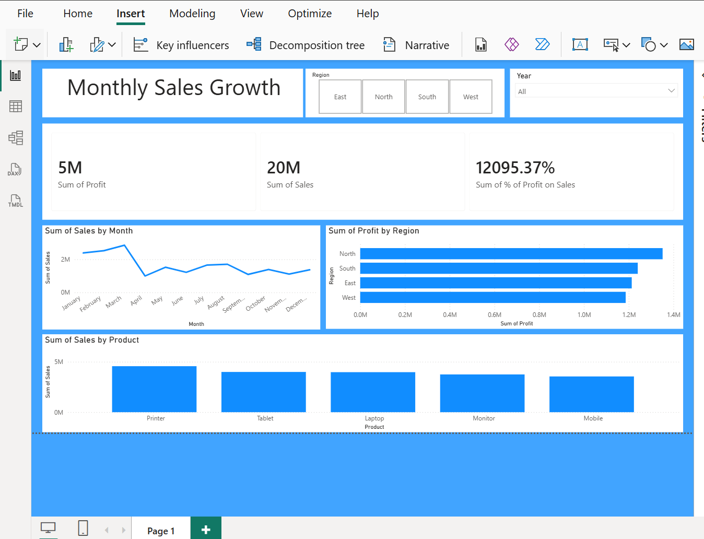

# Sales Performance Analytics Dashboard

## 📊 Project Visual
Below is the final interactive dashboard developed in Power BI, connected to a cleaned MySQL database.

---

## 🚀 Quick Business Insights
* **Regional Sales:** The dashboard provides a clear breakdown of sales volume across East, West, North, and South regions.
* **Profitability:** Using the DAX measure `% of Profit on Sales`, we can instantly identify high-margin product categories.
* **Data Quality:** The visuals represent the final **482 records** after cleaning 520 raw entries in Python.
